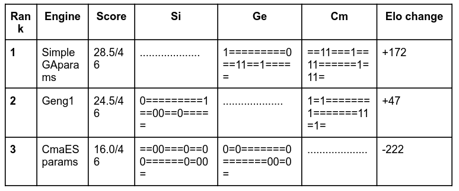
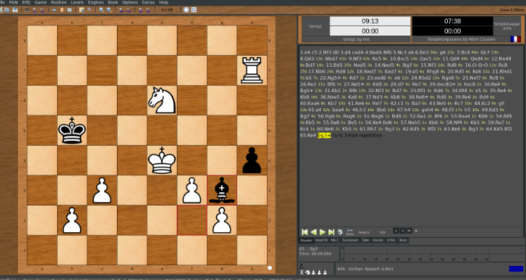

# Chess-Engine

<i> Note: Please star the repo if you find this project useful. </i>

## Description

Our main goal to achieve towards the end of this project is to come up with 3 evolutionary algorithms namely Genetic Algorithm, Differential Evolution and CMA-ES for optimizing the parameters of the evaluation function in our chess engine. In addition, we also want to implement an efficient search algorithm to come up with the best move in a given position given the evaluation provided by the evaluation function. This is necessary as an engine may have the best evaluation algorithm, however without a quick search algorithm(one that prunes unfavourable positions), the engine would take too long to play a move.

To better represent our results, we shall also implement a chess board developed using the python pygame library. This chess board would be used to show the move played and the evaluation of the position provided by the evaluation function

## Technical Specification

### Board Representation

We will use bitboards to represent the state of the chess board. A total of 64 bits are used for a single bitboard and in each of the bitboards, a single bit represents a square on the chess board. We need a seperate bitboard for each colour and piece, hence 12 bitboards will completely represent any board state. For a given bitboard, a 1-bit tells us that the piece represented by the given bitboard is present on a particular square on the game board.

### Search

To select the best possible move in any given position we will first generate a game tree of various possible future states resulting from playing a certain move and then use our evaluation function to assign a value to those states. The move that results in the highest valued state will be played by our AI. Since the search tree for any non-trivial game state move will grow exponentially, we will use alpha beta for pruning the game tree.

### Evaluation Function

The evaluation function of our engine is based on a set of parameters (eg: piece values, piece mobility values, etc). The values for these parameters will be optimised using the chosen learning algorithms (CMA-ES, GA and differential evolution). We will use the TCEC database and Lichess Elite database for our training and testing datasets. A set of 20,000 games will be selected (with the constraint that all these games result in a winning player) to optimize our parameters, this process will be repeated 10 times to get 10 different sets of parameters. Next we will play these 10 different sets of parameters against each other and select the best set using an elo based rating system.

### Training Parameters

First we will encode our evaluation parameters in a bit array, where each parameter will have 6 bits. Since there are 33 evaluation parameters, the bit array’s length is 198 bits. Next we randomly generate a population of these bit arrays (organisms), after the training process, the best out of these bit arrays will be chosen. Now, to train these organisms, we select 5000 positions out of our set of games and let each organism predict the next move on these positions. Each organism gets a score based on the number of correct moves it predicted. A fixed percentage of organisms are then selected based on their score for the next iteration of learning. This process repeats until the changes in the prediction scores don't differ significantly between two iterations.

### Algorithms

In this project we have considered three different algorithms to train parameters for our chess engine.

- 
 <b> Genetic Algorithm: </b> GA is an type of evolutionary algorithm inspired by the process of natural selection. GA is used mainly for optimising hyperparameters and performing guided search on a large solution space. In our AI, we are using GA to optimize the parameters of the evaluation function. 

- 
 <b> Covariance-Matrix Adaptation Evolution Strategy: </b> CMA-ES is a variant of basic GA, it uses an adaptive measure for the standard deviation between the different organisms in the population. This enables the algorithm to search a larger area of the solution set. 

- 
 <b> Differential evolution algorithm: </b> Differential evolution is a population based optimisation algorithm that differentiates itself from GA and CMA-ES by updating the population based on a single candidate individual. This candidate individual is created by combining multiple different individuals, this process is controlled by a scalar parameter called differential weight. 

## Results

Tournament Results 

 GUI 

## Conclusion

Deep learning has inarguably brought about tremendous AI advances in recent years, and more are likely to come. Nonetheless, we believe that evolutionary computation approaches to AI are historically understudied and will ultimately yield similar leaps in AI capabilities — either building on those provided by deep learning, or offering altogether new ones. We have taken a step towards implementing evolutionary algorithms like Simple genetic algorithm, Differential Evolution and CMA -ES in the field of chess. We speculate that evolutionary computation methods could lead to AI that is highly computationally efficient. By evolving chess agents on a given hardware platform and properly designing the genes-to-instructions mapping, genes that accelerate task completion, could be selected for optimizing performances

From observation, it was found that CMA-ES performed the best among the three, predicting more correct moves against the grandmaster dataset. Differential Evolution and Simple GA performed equally well.

